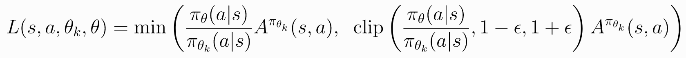
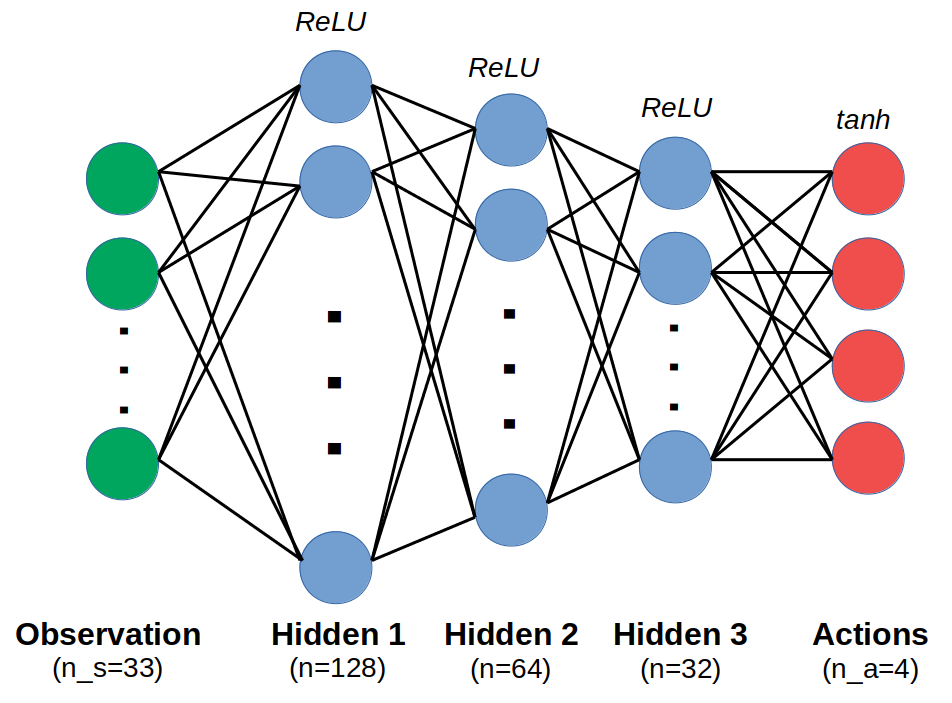
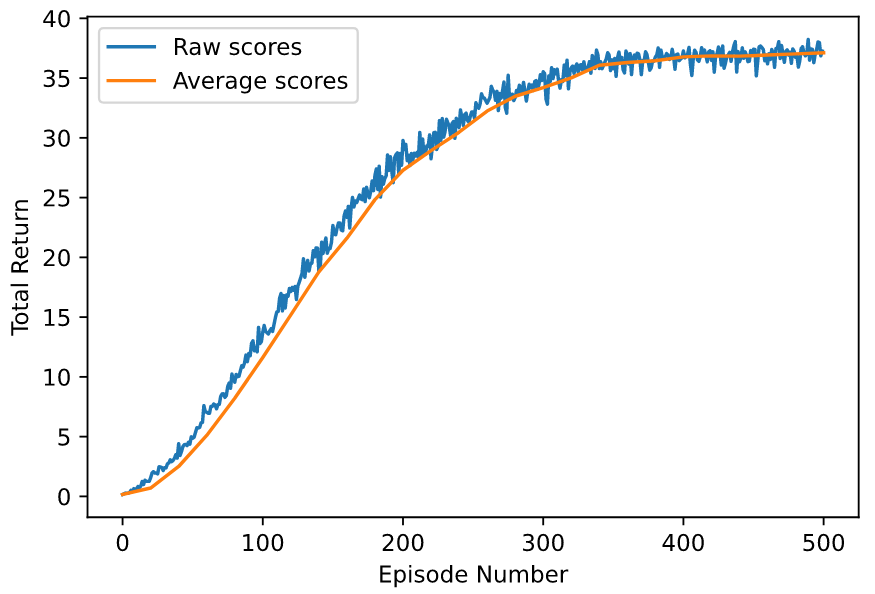

# Continuous Control Project - Technical Report

By Sebastian Castro, 2020

---

## Learning Algorithm

### Approach

For this project, we implemented the [Proximal Policy Optimization (PPO)](https://openai.com/blog/openai-baselines-ppo/) algorithm.

This was selected because it is a policy gradient type of reinforcement learning algorithm that can handle a continuous action space. [Compared to other methods like Deep Deterministic Policy Gradient (DDPG)](https://arxiv.org/abs/1509.02971), which was used in the benchmark implementation for this project, PPO is more stable. However, as an on-policy algorithm (whereas PPO is off-policy), we do not maintain an experience buffer and therefore this algorithm can be less sample efficient.

The central equation behind PPO is the **clipped surrogate loss function** used to train a model using the policy gradient approach. This is an approximation to the loss function used in Trust Region Policy Optimization (TRPO), which uses a constraint on the KL Divergence between the probability distributions of choosing an action in old vs. current policies. In general, PPO has been successful because it performs equivalently to TRPO but is easier to implement.

PPO for continuous action spaces differs slightly from the discrete action space case. While the policy for discrete action system directly outputs action probabilities which can be used by PPO, the policy for the continuous action system outputs the parameters of a continuous probability distribution (e.g. the mean and variance of a Gaussian distribution). This means that at runtime we must sample from the distribution that the policy produces, and at training evaluate the probability distribution function (PDF) for a given action to estimate the probability of having taken that action with that policy.

For more details, refer to [this thread on Reddit](https://www.reddit.com/r/reinforcementlearning/comments/adg447/ppo_with_continuous_actions/).

---

### Neural Network Architecture

We have selected a fully-connected network with 3 hidden layers of decreasing width, from 128 to 32. 

Each hidden layer uses a rectified linear unit (ReLU) activation function to encode nonlinearity in the network. However, the final layer uses a hyperbolic tangent (tanh) activation function since the output action needs to be constrained between `-1` and `1`.

Again, recall that the output actions define the *mean* of the actions, so we have a separate learnable parameter for the variance of these actions. For now we assume the actions are independent, so the probability of taking an action is the product of the probabilities for each individual element; however, a multivariate distribution with a full covariance matrix that has off-diagonal elements is also possible.

---

### Hyperparameters

The hyperparameters used for training our agent using PPO is as follows.

#### PPO Parameters
`EPSILON` is chosen to start with a value of `0.15`, which is in the middle of the typical range. We also decay `EPSILON` with a scaling factor of `0.999` after each episode.

This parameter dictates how far away the ratio of probabilities between the current and old policy is allowed to deviate. For this value, it means the probability ratio is clipped between `1-0.15 = 0.85` and `1+0.15 = 1.15`. This is the main contribution to the stability of PPO.

`BETA` is a scaling factor for entropy regularization in the loss function. This encourages the agent to explore by taking more random steps. `BETA` starts at a value of `0.01` and decays with a factor of `0.995` at the end of each episode.

#### Training Parameters
* Learning rate is `2e-4` all throughout training
* Training is run for `500` total episodes
* At the end of each episode, we perform stochastic gradient descent for `10` epochs with a mini-batch size of `128`.

Recall that each episode runs the agents for a total of 1001 time steps, so every episode is therefore associated with `10*ceil(1001/128) = 80` gradient descent steps.

---

## Results

As per the project specification, an agent is considered to have "solved" the problem if the average reward over all the agents exceeds `30` by the end of an episode.

In our implementation, the policy learns to get about `37` total reward, averaged over all the agents, by `500` episodes. See the results below.

The GIF below shows a snippet of our final trained agent running. You can also find the final weights of our policy in the `trained_weights.pth` file.

---

## Future Work

Off-policy algorithms such as `DDPG` tend to be more sample efficient as they use a replay buffer so they do not discard information about older episodes. This means that training can resume with all the data collected so far rather than with the most recent data. We did not benchmark with these algorithms in this implementation, but the project benchmark shows the DDPG solution converges in about 250 episodes, which is half the number used here. However, it can also be seen that DDPG has challenges with stability and needed to be configured appropriately.

There are other policy gradient approaches like `ACER` (Actor Critic with Experience Replay), which combine the sample efficiency of algorithms like DDPG with the stability of algorithms like PPO. This could be a promising algorithm to explore in the future.

On the software implementation side, one of the key benefits of on-policy agents like PPO is that the execution and training of agents is parallelizable. We did not attempt any parallel computing in this project, but is something that would be important for more complicated environments that may take thousands of episodes (or more) to converge.

As a general resource for readers, [this blog from OpenAI's Lilian Weng](https://lilianweng.github.io/lil-log/2018/04/08/policy-gradient-algorithms.html) explains and compares policy gradient algorithms.